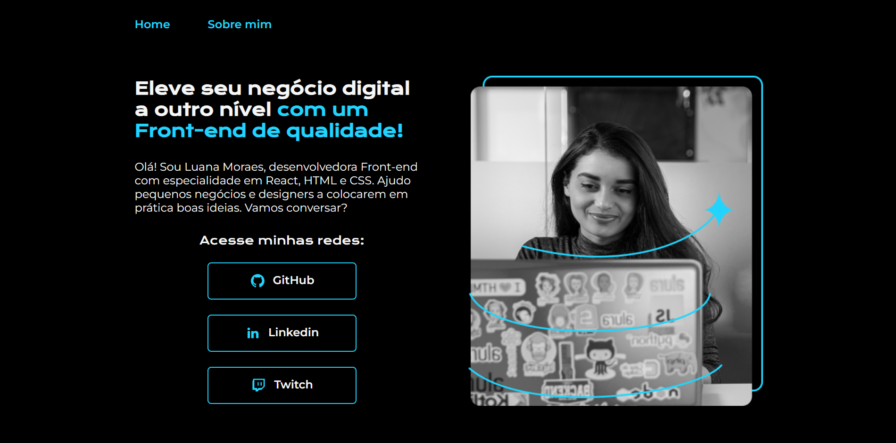

# Portfólio Exemplo: Luana Moraes

## 👨🏻‍💻 [Abrir Projeto](https://portfolio-exemple-luanamoraes.vercel.app)

## 📝 Introdução

Esse é um projeto criado como exemplo de um portfólio moderno e totalmente responsivo, desenvolvido com base nos cursos de HTML e CSS da instituição Alura.

## 💡 Sobre

O projeto se refere a um portfólio criado para a desenvolvedora Front-End Luana Moraes, especialista em React, HTML e CSS, no qual foi desenvolvido duas páginas:

- 🏠 Home: Página inicial, onde contém um breve resumo sobre a desenvolvedora Luana Moraes, com os links para as redes sociais: GitHub, Linkedin e Twitch, para contato ou conhecerem seus projetos.

- 📝 Sobre mim: Página onde detalha maiores informações sobre a desenvolvedora Luana Moraes, onde foi definido um texto fictício, mais conhecido como "Lorem Ipsum"

## 📚 Conhecimentos

Para estudo e aplicação do projeto, foi utilizado os contéudos de HTML e CSS para projetos web na plataforma da Alura:

- [HTML e CSS: ambientes de desenvolvimento, estrutura de arquivos e tags](https://cursos.alura.com.br/course/html-css-ambiente-arquivos-tags?preRequirementFrom=html-css-cabecalho-footer-variaveis-css)
- [HTML e CSS: Classes, posicionamento e Flexbox](https://cursos.alura.com.br/course/html-css-classes-posicionamento-flexbox?preRequirementFrom=html-css-cabecalho-footer-variaveis-css)
- [HTML e CSS: cabeçalho, footer e variáveis CSS](https://cursos.alura.com.br/course/html-css-cabecalho-footer-variaveis-css_)
- [HTML e CSS: trabalhando com responsividade e publicação de projetos](https://cursos.alura.com.br/course/html-css-responsividade-publicacao-projetos)

## 🤖 Tecnologias

  
  
  

---

- `HTML`: O HTML tem um papel fundamental pois é através dele que realizamos o desenvolvimento da estrutura e definimos e organizamos o contéudo de forma que seja facilmente interpretado pelos navegadores web.

- `CSS`: O CSS tem papel fundamental para controlar a aparência e o layout do nosso portfólio, proporcionando uma experiência visual atraente, responsiva e consistente para os usuários.

- `Devicon`: Utilizei a coleção de ícones de alta qualidade do Devicon, justamente para representar os icones das tecnologias aqui utilizados, esse ícones são projetados para representar várias tecncologias e ferramentas de desenvolvimento de software.
---
**Desenvolvido por [Rodrigo Moraes](https://github.com/rodrigomoraesdev)**
